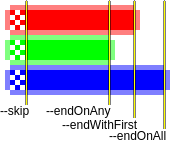

# byteblender

This command-line utility mixes the data of input files by selecting bytes from each file cyclically.

## Installation
Compile `main.c`.

## Usage
### Arguments
- `-n, --chunk <number>` sets the amount of bytes to select at once. *1 by default.*
- `-h, --help` shows the help message.
- `-v, --verbose` enables verbose mode.
- `-o, --output <filename|"-">` output file, use minus sign <kbd>-</kbd> for stdout.
- `--skip <number>` amount of bytes from beginnings of all input files to ignore. *0 by default.*
- `--noSkipFile1` excludes the first input file from effects of `--skip`.
- Choice of end condition - when byteblender should quit. Only the last option in the argument list will take effect.
  - `--endOnAny` exit when any of the input files ends.
  - `--endWithFirst` exit when the first input file ends.
  - `--endOnAll` exit when all of the input files end.
  - 